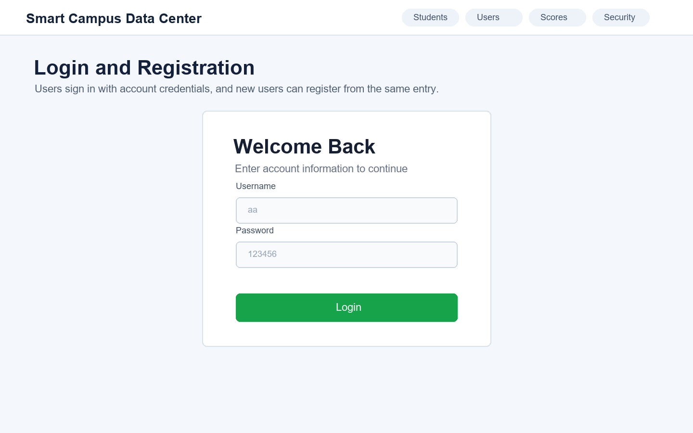
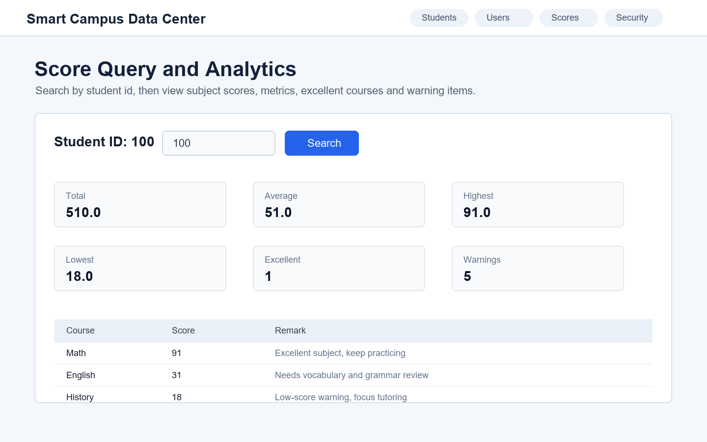
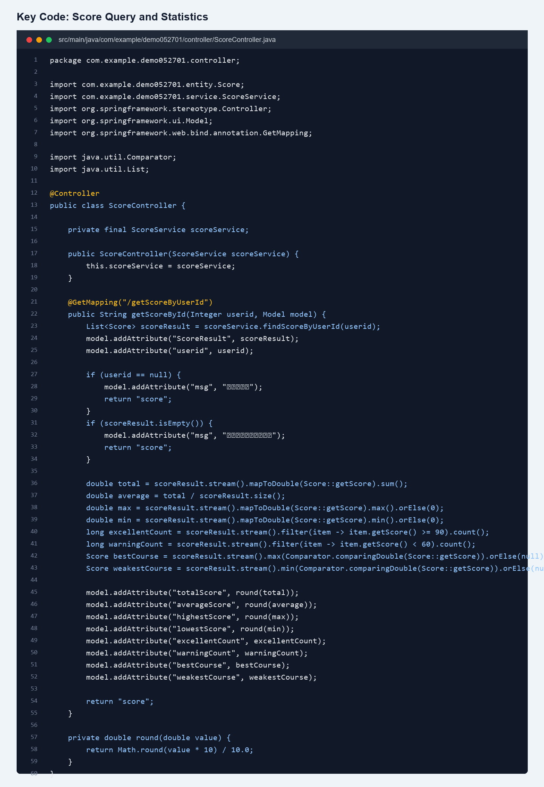
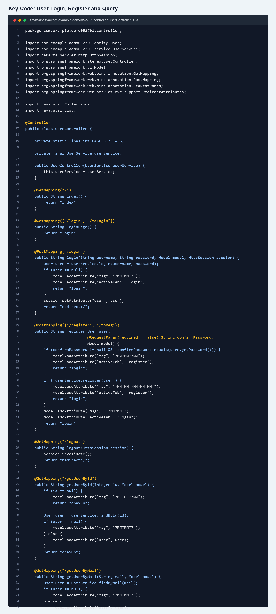
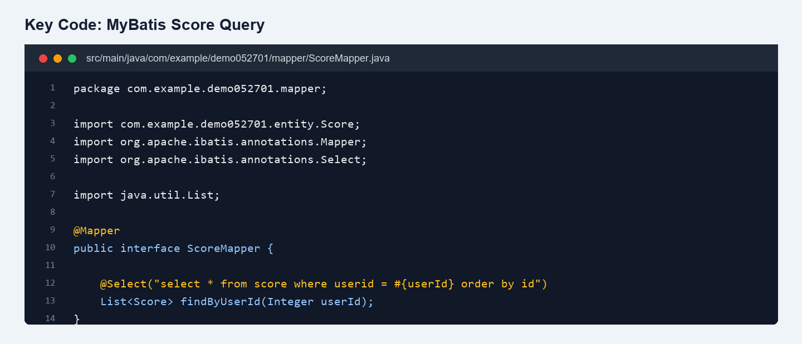

# Online Exam System

一个基于 Spring Boot 的在线考试/智慧校园数据管理系统，提供用户登录注册、学生信息查询、用户状态分页筛选、成绩查询与成绩统计分析等功能。项目使用 Thymeleaf 渲染页面，MyBatis 访问 MySQL 数据库，适合作为课程设计、Web 后端开发练习或校园管理系统演示项目。

## 功能简介

- 用户登录、注册、退出登录
- 根据用户 ID 查询学生档案
- 根据邮箱查询用户信息
- 根据用户状态分页查询用户列表
- 修改用户密码
- 根据学号查询成绩
- 自动统计总分、平均分、最高分、最低分、优秀科目数和低分预警数
- 提供统一页面样式和成绩分析页面

## 项目截图

### 首页功能总览


### 登录注册页面



### 成绩分析页面



## 关键代码截图

### 成绩查询与统计分析

`ScoreController` 负责接收学号查询请求，调用 `ScoreService` 获取成绩列表，并计算总分、平均分、最高分、最低分、优秀科目数、低分预警数等统计指标。



### 用户登录、注册与查询

`UserController` 负责登录注册、退出登录、用户 ID 查询、邮箱查询、状态分页查询和密码修改等用户相关功能。



### MyBatis 成绩查询

`ScoreMapper` 使用 MyBatis 注解 SQL，根据学号查询成绩并按记录 ID 排序。



## 技术栈

- Java 17
- Spring Boot 3.3.5
- Spring MVC
- Thymeleaf
- MyBatis
- MySQL
- Maven

## 项目结构

```text
.
├── SQL/                         # 数据库初始化脚本
├── note/                        # 项目截图或说明图片
├── src/main/java/com/example/demo052701
│   ├── controller/              # 控制器
│   ├── entity/                  # 实体类
│   ├── mapper/                  # MyBatis Mapper
│   └── service/                 # 业务逻辑
├── src/main/resources
│   ├── static/css/              # 页面样式
│   ├── templates/               # Thymeleaf 页面
│   ├── application.properties   # 应用配置
│   └── sql/                     # SQL 脚本备份
└── pom.xml
```

## 环境要求

- JDK 17 或以上
- Maven 3.8 或以上，也可以直接使用项目自带的 `mvnw`
- MySQL 8.0 或以上

## 数据库配置

默认数据库配置位于 `src/main/resources/application.properties`：

```properties
spring.datasource.url=jdbc:mysql://localhost:3306/person?serverTimezone=Asia/Shanghai&useSSL=false&allowPublicKeyRetrieval=true&characterEncoding=utf8
spring.datasource.username=root
spring.datasource.password=123456
```

也可以通过环境变量覆盖：

```bash
DB_URL=jdbc:mysql://localhost:3306/person?serverTimezone=Asia/Shanghai&useSSL=false&allowPublicKeyRetrieval=true&characterEncoding=utf8
DB_USERNAME=root
DB_PASSWORD=123456
```

## 初始化数据库

进入 MySQL 后执行项目中的 SQL 脚本：

```sql
SOURCE SQL/user060302.sql;
SOURCE SQL/score060301.sql;
```

或者在 `SQL` 目录下执行：

```sql
SOURCE init.sql;
```

## 启动项目

Windows：

```bash
mvnw.cmd spring-boot:run
```

macOS / Linux：

```bash
./mvnw spring-boot:run
```

启动成功后访问：

```text
http://localhost:8080/
```

## 演示数据

项目 SQL 脚本中包含示例用户和成绩数据，可用于快速体验：

| 用户名 | 密码 | 学号 |
| --- | --- | --- |
| aa | 123 | 100 |
| bb | 789 | 200 |

成绩查询页面可输入学号 `100` 或 `200` 查看成绩分析结果。

## 主要页面

- `/`：首页
- `/login`：登录/注册
- `/getUserById`：按 ID 查询用户
- `/getUserByMail`：按邮箱查询用户
- `/getUserByStatus`：按状态查询用户
- `/getScoreByUserId`：按学号查询成绩
- `/updatepassword`：修改密码

## 说明

本项目用于学习和演示，默认账号密码、数据库连接信息均为本地开发配置。部署到生产环境前，应修改数据库密码、补充权限校验，并对用户密码进行加密存储。
